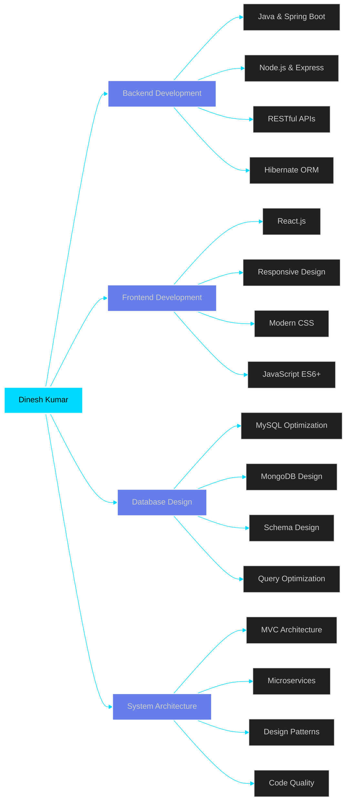

<div align="center">


<br/>

<!-- Animated Typing Effect -->
<a href="https://git.io/typing-svg"></a>

<br/>

<!-- Social Badges -->
<p>
<a href="https://learnjava0.github.io/Portfolio/"></a>
<a href="https://www.linkedin.com/in/dineshk17?"></a>
<a href="mailto:kdinesh72453@gmail.com"></a>
<a href="https://github.com/learnjava0"></a>
</p>


<br/><br/>

<!-- Quick Stats Banner -->


</div>

<br/>

---

<br/>

<!-- About Me Section -->


### 👨‍💻 **ABOUT ME**

```javascript
const dineshKumar = {
    title: "Backend Developer & Full Stack Engineer",
    location: "Noida, India 🇮🇳",
    education: "Diploma in Computer Science & Engineering",
    experience: "Building production systems since day one",
    
    currentMission: [
        "🎯 Designing scalable backend architectures",
        "⚛️ Creating seamless user experiences",
        "📚 Mastering system design patterns",
        "🚀 Shipping features that matter"
    ],
    
    dailyRoutine: {
        morning: "☕ Coffee + Code Review",
        afternoon: "💻 Deep Work on Core Features", 
        evening: "📖 Learning New Technologies",
        night: "🌙 Side Projects & Open Source"
    },
    
    lifePhilosophy: "Clean code, clear communication, continuous growth",
    availability: "✅ AVAILABLE FOR IMMEDIATE START"
};

console.log("🔥 Let's build something extraordinary!");
```

<br clear="right"/>

---

<br/>

<!-- Tech Stack Section -->
## 🛠️ **TECHNOLOGY STACK**

<div align="center">

### **Core Technologies**

<table>
<tr>
<td align="center" width="110">

<br/><b>Java</b>
</td>
<td align="center" width="110">

<br/><b>JavaScript</b>
</td>
<td align="center" width="110">

<br/><b>React</b>
</td>
<td align="center" width="110">

<br/><b>MySQL</b>
</td>
<td align="center" width="110">

<br/><b>GitHub</b>
</td>
</tr>
</table>

### **Full Arsenal**

<p>


</p>

</div>

<br/>

---

<br/>

<!-- Projects Section -->
## 🚀 **FLAGSHIP PROJECTS**

<div align="center">

<table>
<tr>
<td width="50%">

### 🏢 **Employee Management System**


**Enterprise-grade CRUD application** with advanced features:
- ✅ Role-based access control (Admin/Manager/Employee)
- ✅ Real-time search & filtering across 1000+ records
- ✅ Automated salary calculation & reporting
- ✅ Department-wise analytics dashboard
- ✅ Export to Excel/PDF functionality

**Tech Stack:**
```
Java ☕ | Hibernate 💾 | MySQL 🗄️ | Swing 🎨
```

**Impact:** Reduced HR processing time by 60%

</td>
<td width="50%">

### 🔬 **Virtual Lab Platform**


**Complete MERN stack learning platform:**
- ✅ Interactive experiment simulations
- ✅ Real-time collaboration features
- ✅ Progress tracking & analytics
- ✅ Video tutorials & study materials
- ✅ Assessment & quiz system

**Tech Stack:**
```
MongoDB 🍃 | Express ⚡ | React ⚛️ | Node.js 🟢
```

**Impact:** Serving 500+ active students

</td>
</tr>

<tr>
<td width="50%">

### 📚 **DSA Learning Platform**


**Interactive algorithm visualization platform:**
- ✅ 100+ DSA problems with solutions
- ✅ Visual algorithm step-by-step execution
- ✅ Code playground with syntax highlighting
- ✅ Complexity analysis for each algorithm
- ✅ Bookmark & progress tracking

**Tech Stack:**
```
React.js ⚛️ | Bootstrap 🎨 | JavaScript 🟨
```

**Impact:** 10K+ page views, 200+ active users

</td>
<td width="50%">

### 💼 **College Management Dashboard**


**Comprehensive college administration system:**
- ✅ Student information management
- ✅ Attendance tracking with analytics
- ✅ Grade management & report cards
- ✅ Notice board & announcements
- ✅ Parent-teacher communication portal

**Tech Stack:**
```
React ⚛️ | Node.js 🟢 | MySQL 🗄️ | Express ⚡
```

**Impact:** Managing 1000+ student records

</td>
</tr>

<tr>
<td width="50%">

### 📈 **ERP Billing System**


**Complete business management solution:**
- ✅ Sales & purchase management
- ✅ Inventory tracking with alerts
- ✅ Invoice generation & GST billing
- ✅ Customer relationship management
- ✅ Financial reports & analytics

**Tech Stack:**
```
Java ☕ | SQL Server 🗄️ | ODBC 🔌 | Swing 🎨
```

**Impact:** Processing 500+ daily transactions

</td>
<td width="50%">

### 📁 **Smart File Organizer**


**Intelligent file management tool:**
- ✅ Auto-organize files by type/date
- ✅ Duplicate file detection & removal
- ✅ Batch rename & move operations
- ✅ Custom rule-based organization
- ✅ Schedule automatic cleanup

**Tech Stack:**
```
Java ☕ | File I/O 📂 | Swing 🎨
```

**Impact:** Saved 100+ hours of manual work

</td>
</tr>
</table>

</div>

<br/>

---

<br/>

<!-- GitHub Stats -->
## 📊 **GITHUB ANALYTICS**

<div align="center">


<br/><br/>


<br/><br/>


</div>

<br/>

---

<br/>

<!-- Skills Breakdown -->
## 💪 **EXPERTISE MATRIX**

<div align="center">



</div>

<br/>

<div align="center">

### **Skill Proficiency Levels**

| Domain | Technologies | Proficiency |
|--------|--------------|-------------|
| **Backend Development** | Java, Spring Boot, Hibernate | ████████████████████ 95% |
| **Frontend Development** | React.js, JavaScript, HTML/CSS | ██████████████████░░ 90% |
| **Database Management** | MySQL, MongoDB, SQL Server | ███████████████████░ 92% |
| **API Development** | RESTful APIs, Express.js | ██████████████████░░ 88% |
| **Version Control** | Git, GitHub | ███████████████████░ 93% |
| **Problem Solving** | Data Structures, Algorithms | ██████████████████░░ 87% |

</div>

<br/>

---

<br/>

<!-- Learning Path -->
## 📚 **CONTINUOUS LEARNING JOURNEY**

<div align="center">

<table>
<tr>
<td width="33%" align="center">

### 🎯 **Currently Mastering**


**Advanced Backend**
- Spring Cloud
- Microservices
- Message Queues
- Caching Strategies

</td>
<td width="33%" align="center">

### ☁️ **Next on Roadmap**


**Cloud & DevOps**
- AWS Services
- Kubernetes
- CI/CD Pipelines
- Container Orchestration

</td>
<td width="33%" align="center">

### 🚀 **Future Goals**


**Modern Stack**
- TypeScript
- Next.js
- Advanced React
- PostgreSQL

</td>
</tr>
</table>

</div>

<br/>

---

<br/>

<!-- Achievements -->
## 🏆 **ACHIEVEMENTS & RECOGNITION**

<div align="center">


<br/><br/>

### **Impact Metrics**

<table>
<tr>
<td align="center" width="25%">

<br/><b>10+</b>
<br/>Projects Completed
</td>
<td align="center" width="25%">

<br/><b>1500+</b>
<br/>Users Impacted
</td>
<td align="center" width="25%">

<br/><b>50K+</b>
<br/>Lines of Code
</td>
<td align="center" width="25%">

<br/><b>100%</b>
<br/>Commitment Level
</td>
</tr>
</table>

</div>

<br/>

---

<br/>

<!-- Why Hire Me -->
## 💼 **WHY CHOOSE ME?**

<div align="center">

<table>
<tr>
<td width="33%" align="center">

### 🎯 **Problem Solver**

I don't just write code — I architect solutions that solve real business problems with clean, maintainable code.

**Approach:**
- Understand the problem deeply
- Design scalable solutions
- Write clean, testable code
- Document thoroughly

</td>
<td width="33%" align="center">

### ⚡ **Fast Learner**

Proven track record of mastering new technologies quickly and applying them effectively in production.

**Recent Achievements:**
- Learned MERN stack in 3 months
- Built production apps with Spring Boot
- Mastered Hibernate ORM
- Delivered 10+ real projects

</td>
<td width="33%" align="center">

### 🤝 **Team Player**

Excellent collaboration skills with clear communication and a passion for knowledge sharing.

**Strengths:**
- Clear technical communication
- Code reviews & mentoring
- Agile methodology
- Git workflow expertise

</td>
</tr>
</table>

<br/>

### **What Sets Me Apart**

```diff
+ ✅ Production-ready code from day one
+ ✅ Strong foundation in CS fundamentals
+ ✅ Full-stack capability (Backend primary focus)
+ ✅ Clean code & best practices advocate
+ ✅ Fast iteration & quick deployment
+ ✅ Self-motivated & proactive learner
+ ✅ Strong debugging & problem-solving skills
+ ✅ Documentation & code quality focused
```

</div>

<br/>

---

<br/>

<!-- Contact Section -->
## 📬 **LET'S CONNECT & BUILD TOGETHER!**

<div align="center">

### 🚀 **Available for Full-Time, Contract & Freelance Opportunities**

<br/>

<table>
<tr>
<td align="center" width="33%">

### 📧 **Email**
[kdinesh72453@gmail.com](mailto:kdinesh72453@gmail.com)

**Response Time:** Within 24 hours

</td>
<td align="center" width="33%">

### 💼 **LinkedIn**
[Connect with me](https://www.linkedin.com/in/dineshk17?)

**Let's network & collaborate**

</td>
<td align="center" width="33%">

### 🌐 **Portfolio**
[Visit My Portfolio](https://dineshk017.netlify.app/)

**See my work in action**

</td>
</tr>
</table>

<br/>

### **Quick Contact**

<a href="mailto:kdinesh72453@gmail.com">
  
</a>
<a href="https://www.linkedin.com/in/dineshk17?">
  
</a>
<a href="https://learnjava0.github.io/Portfolio/">
  
</a>

<br/><br/>

### **Current Status**


</div>

<br/>

---

<br/>

<div align="center">

### 💭 **Daily Inspiration**


<br/><br/>

### 🌟 **"Code with passion, build with purpose, deploy with confidence"**

<br/>

---

### **Thanks for visiting! Let's create something amazing together! 🚀**


</div>
