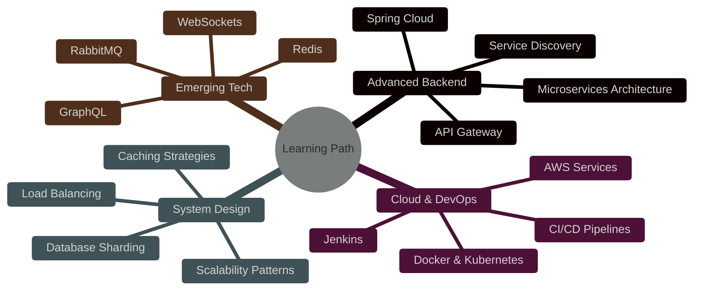

<div align="center">


<br/>

[](https://learnjava0.github.io/Portfolio/)
[](https://www.linkedin.com/in/dineshk17?)
[](mailto:kdinesh72453@gmail.com)


</div>

---


### 🚀 `System.out.println("Hello World!");`

```java
@Developer
public class DineshKumar {
    
    private String role = "Backend Developer";
    private String location = "Noida, India 🇮🇳";
    private String education = "CSE Diploma";
    private boolean hirable = true;
    
    private String[] expertise = {
        "Enterprise Application Development",
        "RESTful API Design & Development",
        "Database Architecture & Optimization",
        "Full Stack Web Development",
        "System Design & Scalability"
    };
    
    public Map<String, List<String>> getTechStack() {
        return Map.of(
            "Backend", List.of("Java", "Spring Boot", "Hibernate", "Node.js"),
            "Frontend", List.of("React.js", "JavaScript", "Bootstrap", "HTML/CSS"),
            "Database", List.of("MySQL", "MongoDB", "SQL Server"),
            "DevOps", List.of("Git", "GitHub", "Postman", "VS Code")
        );
    }
    
    public String getCurrentStatus() {
        return "🔥 Building Production-Ready Applications";
    }
}
```

<br clear="right"/>

---

## 🎯 **What I Bring to the Table**

<table>
<tr>
<td width="50%" valign="top">

### 💼 **Professional Skills**

```typescript
const skills = {
  backend: {
    languages: ['Java ☕', 'JavaScript 🟨', 'PHP 🐘'],
    frameworks: ['Spring Boot 🍃', 'Hibernate 💾', 'Express.js ⚡'],
    expertise: ['RESTful APIs', 'MVC Architecture', 'ORM Design']
  },
  
  frontend: {
    libraries: ['React.js ⚛️', 'Bootstrap 🎨'],
    technologies: ['HTML5', 'CSS3', 'ES6+'],
    capabilities: ['Responsive Design', 'SPA Development']
  },
  
  database: {
    sql: ['MySQL 🐬', 'SQL Server 🗄️'],
    nosql: ['MongoDB 🍃'],
    skills: ['Query Optimization', 'Schema Design', 'JDBC/ODBC']
  }
};
```

</td>
<td width="50%" valign="top">

### 🎖️ **Achievement Metrics**

```python
achievements = {
    'projects_completed': '10+ Production Projects',
    'code_quality': 'Clean & Maintainable',
    'problem_solving': 'Data Structures & Algorithms',
    'learning_rate': 'Continuous Upskilling',
    'collaboration': 'Team Player & Individual Contributor',
    'availability': '✅ Open to Opportunities'
}

print(f"Passion Level: {'🔥' * 5}")
print(f"Commitment: {'⭐' * 5}")
```

</td>
</tr>
</table>

---

## 🏗️ **Featured Production Projects**

<details open>
<summary><b>🔥 Click to Explore My Work</b></summary>
<br/>

<table>
<tr>
<td width="50%">
<h3 align="center">🏢 Employee Management System</h3>
<div align="center">  
<a href="#">

</a>
<br/><br/>
<p>


</p>
<p><strong>Enterprise-grade CRUD system</strong> with role-based access control, advanced search, and reporting features. Handles 1000+ employee records efficiently.</p>
</div>
</td>

<td width="50%">
<h3 align="center">🔬 Virtual Lab Platform</h3>
<div align="center">
<a href="#">

</a>
<br/><br/>
<p>


</p>
<p><strong>Full-stack MERN application</strong> for online experiments with real-time collaboration, progress tracking, and interactive simulations.</p>
</div>
</td>
</tr>

<tr>
<td width="50%">
<h3 align="center">📚 DSA Learning Platform</h3>
<div align="center">
<a href="#">

</a>
<br/><br/>
<p>


</p>
<p><strong>Interactive learning platform</strong> with algorithm visualizations, 100+ practice problems, and comprehensive study materials with video tutorials.</p>
</div>
</td>

<td width="50%">
<h3 align="center">📈 ERP Billing System</h3>
<div align="center">
<a href="#">

</a>
<br/><br/>
<p>


</p>
<p><strong>Complete ERP solution</strong> managing sales, inventory, billing, and CRM. Processes 500+ daily transactions with automated reporting.</p>
</div>
</td>
</tr>
</table>

</details>

---

## 📊 **GitHub Analytics & Performance**

<div align="center">
<table>
<tr>
<td width="50%">

</td>
<td width="50%">

</td>
</tr>
</table>


</div>

<details>
<summary><b>📈 Detailed Language Statistics</b></summary>
<br/>
<div align="center">


</div>
</details>

---

## 🛠️ **Technology Arsenal**

<div align="center">

<table>
<tr>
<td align="center" width="96">

<br/>Java
</td>
<td align="center" width="96">

<br/>Spring
</td>
<td align="center" width="96">

<br/>Hibernate
</td>
<td align="center" width="96">

<br/>JavaScript
</td>
<td align="center" width="96">

<br/>React
</td>
<td align="center" width="96">

<br/>Node.js
</td>
<td align="center" width="96">

<br/>Express
</td>
<td align="center" width="96">

<br/>MongoDB
</td>
<td align="center" width="96">

<br/>MySQL
</td>
</tr>
<tr>
<td align="center" width="96">

<br/>HTML5
</td>
<td align="center" width="96">

<br/>CSS3
</td>
<td align="center" width="96">

<br/>Bootstrap
</td>
<td align="center" width="96">

<br/>PHP
</td>
<td align="center" width="96">

<br/>Git
</td>
<td align="center" width="96">

<br/>GitHub
</td>
<td align="center" width="96">

<br/>VS Code
</td>
<td align="center" width="96">

<br/>Postman
</td>
<td align="center" width="96">

<br/>Netlify
</td>
</tr>
</table>

</div>

---

## 🏆 **Achievements & Recognition**

<div align="center">
  


</div>

---

## 📚 **Currently Mastering**

<div align="center">



</div>

---

## 💡 **Why Hire Me?**

<table>
<tr>
<td width="33%" align="center">

### 🎯 **Problem Solver**
I don't just write code, I solve business problems with elegant technical solutions.

</td>
<td width="33%" align="center">

### ⚡ **Fast Learner**
Quickly adapt to new technologies and frameworks. Always staying ahead of the curve.

</td>
<td width="33%" align="center">

### 🤝 **Team Player**
Collaborative mindset with excellent communication skills. Ready to contribute from day one.

</td>
</tr>
<tr>
<td width="33%" align="center">

### 📈 **Growth Mindset**
Constantly improving through learning, practice, and real-world project experience.

</td>
<td width="33%" align="center">

### 🔧 **Production Ready**
Experience building and deploying real applications that handle actual user traffic.

</td>
<td width="33%" align="center">

### 💼 **Professional**
Clean code, documentation, version control, and best practices in every project.

</td>
</tr>
</table>

---

## 📬 **Let's Build Something Amazing Together!**

<div align="center">

### 🚀 **I'm actively seeking opportunities to contribute to innovative projects!**

<br/>

<a href="https://www.linkedin.com/in/dineshk17?">
  
</a>
<a href="mailto:kdinesh72453@gmail.com">
  
</a>
<a href="https://learnjava0.github.io/Portfolio/">
  
</a>

<br/><br/>

### 📊 **Response Time**


-orange?style=flat-square&labelColor=1a1a1a)

<br/>

---


---

<p align="center">

</p>

**💼 Open for Full-Time, Contract & Freelance Opportunities | 🌟 Let's Connect & Create Impact!**

</div>
